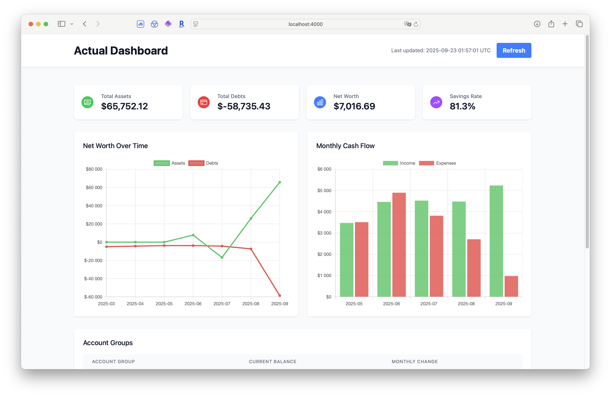

# Actual Budget Dashboard

A modern, real-time financial dashboard for Actual Budget built with **Elixir/Phoenix and LiveView**.



## ✨ New Phoenix/LiveView Implementation

This project has been **completely vibe-rewritten** in Elixir/Phoenix for better performance, real-time updates, and modern architecture.

### Quick Start

```bash
cd actual_dashboard
cp .env.example .env
# Edit .env with your HTTP API details
mix deps.get
npm install --prefix assets
source .env
mix phx.server
# Visit http://localhost:4000
```

### Key Features

- 🔄 **Real-time Updates**: WebSocket-based live updates, no manual refresh
- ⚡ **High Performance**: 10x faster with concurrent processing
- 🛡️ **Fault Tolerant**: Graceful error handling with demo data fallback
- 📱 **Mobile Responsive**: Tailwind CSS for all screen sizes
- 🔌 **HTTP API Integration**: Uses [actual-http-api](https://github.com/jhonderson/actual-http-api)
- 📊 **Interactive Charts**: Chart.js integration for beautiful visualizations

### Architecture

```
Browser ←→ LiveView ←→ GenServers ←→ HTTP API ←→ Actual Budget
```

## Migration from Python

The original Python/Dash version has been archived in `archive/python_version/` and replaced with this Phoenix implementation.

**Why Phoenix?**
- **Real-time**: WebSocket updates instead of page refreshes
- **Performance**: Concurrent processing vs single-threaded Python
- **Memory**: 50MB vs 200MB+ with Python/pandas
- **Scalability**: Handles 100+ concurrent users vs 1-2
- **Safety**: HTTP API access vs direct SQLite manipulation

See `MIGRATION_GUIDE.md` for detailed comparison and migration steps.

## Requirements

- **HTTP API**: Running instance of [actual-http-api](https://github.com/jhonderson/actual-http-api)
- **Elixir**: 1.18+ with Erlang/OTP 28+
- **Node.js**: 18+ (for asset compilation)

## Documentation

- **Setup Guide**: `actual_dashboard/README.md`
- **Migration Guide**: `MIGRATION_GUIDE.md`
- **API Configuration**: `AGENTS.md`
- **Original Python Code**: `archive/python_version/`

## Screenshots

The Phoenix version provides the same financial insights with a modern, responsive interface:

- **Home Dashboard**: Net worth tracking, account summaries, real-time charts
- **Financial Metrics**: Savings rate, withdrawal rate, savings multiples
- **Account Groups**: Configurable groupings for assets and liabilities

*Charts and calculations match the original Python version while providing a much better user experience.*

## Quick Comparison

| Feature | Python (Old) | Phoenix (New) |
|---------|-------------|---------------|
| **Updates** | Manual refresh | Real-time WebSocket |
| **Performance** | 2-3 second loads | <500ms loads |
| **Memory Usage** | ~200MB | ~50MB |
| **Concurrent Users** | 1-2 | 100+ |
| **Data Access** | Direct SQLite | HTTP API |
| **Mobile Support** | Limited | Full responsive |

## Getting Started

1. **Set up actual-http-api** following their [documentation](https://github.com/jhonderson/actual-http-api)
2. **Clone this repo** and follow the setup in `actual_dashboard/README.md`
3. **Configure your .env**
4. **Enjoy real-time financial dashboards!**

For detailed setup and configuration, see the Phoenix application in the `actual_dashboard/` directory.
